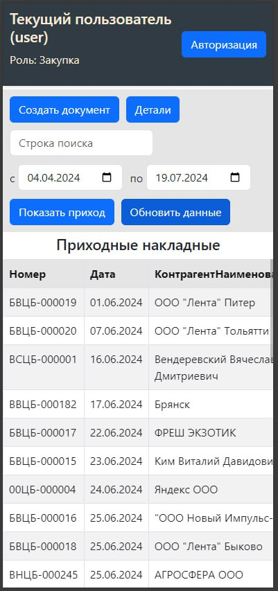

## Описание

Данный проект представляет собой взаимодействие серверной части (1С) и веб-клиента, который с помощью REST API отправляет запросы на сервер и отображает данные на клиенте. 

Пользователь вводит необходимый период для отображения нужных документов (приходных и расходных накладных), редактирует необходимые поля в соответствии с ролями пользователей, создаёт и отправляет новые документы.

При создании документа пользователь выбирает дату, контрагента, договор, склады и добавляет детали товаров, такие как наименование, количество, вес загрузки, процент потерь, цену и сумму. Приложение автоматически рассчитывает необходимые параметры на основе введённых данных.

Для отображения статуса отправки, ошибок и успешных сообщений используются модальные окна.

## Функции

- **Авторизация пользователей**: Проверка и назначение ролей для пользователей (склад, закупка).
- **Создание документов**: Возможность создания новых приходных и расходных документов.
- **Просмотр документов**: Отображение списка документов с возможностью поиска и фильтрации по дате и типу документа.
- **Редактирование документов**: Возможность редактирования документов в зависимости от ролей пользователей и настроек.
- **Детали документа**: Просмотр и редактирование подробной информации о выбранном документе.
- **Фильтрация и поиск**: Фильтрация документов по дате, типу и статусу проведения.
- **Настройки**: Возможность настройки параметров приложения, таких как количество дней для редактирования документов.
- **Загрузка и отправка данных на сервер**: Использование GET, POST и PATCH запросов.
- **Валидация данных**: Форма включает валидацию, которая проверяет заполненность всех обязательных полей перед отправкой данных на сервер.
- **Асинхронные запросы**: Проект использует асинхронные запросы для взаимодействия с API 1С для получения данных о контрагентах, организациях, договорах, складах и товарах.
- **Модальные окна**
  - Подтверждение отправки: Отображается во время отправки данных.
  - Ошибка: Отображается в случае ошибки при отправке данных.
  - Успешное сообщение: Отображается при успешном создании документа.

### Роли пользователей
* Склад: Пользователи с ролью "ЕстьРольСклад" могут просматривать и редактировать вес выгрузки и процент потерь.
* Закупка: Пользователи с ролью "ЕстьРольЗакупка" могут создавать новые документы и редактировать комментарии и вес загрузки.

## Структура проекта

- **src/**
  - **components/**
    - `Description.js`: Компонент для отображения и редактирования деталей документа.
    - `ListDoc.js`: Компонент для отображения списка документов.
    - `NewDocumentForm.js`: Компонент для создания нового документа.
  - **services/**
    - `1cDB.js`: Функции для взаимодействия с API.
  - **styles/**
    - `styles.css`: Стили для компонентов.
- **public/**
  - Файлы для статического контента, такие как `index.html`.

### Используемые технологии

Для разработки данного проекта исопльзовался React, а также библиотеки React-Bootstrap и React-Select.

## Установка и запуск

### Требования

- Node.js (рекомендуемая версия 14.x или выше)
- npm или yarn

### Установка

1. Склонируйте репозиторий:

   ```sh
   git clone <repository-url>
   ```
2. Перейдите в папку:

   ```sh
   cd nameproject
   ```
3. Установите зависимости:

   ```sh
   npm install
   ```
4. Запустить проект:

   ```sh
   npm start
   ```
5. Собрать проект:

   ```sh
   npm run build
   ```

## Демонстрация работы веб-сервиса

### На ПК
Авторизация в приложении


Главный экран для закупки и для склада. Стоит обратить внимание, что набор функции и разных ролей пользователей разных, поэтому отображаются разные поля, только с закупки есть право на создание докуммента, а у склада еще просмотр расходных накладных.




Далее можно посмотреть детали документа


Также есть функция создания документа у пользователей с ролью закупка. Далее приведены версии для ПК и мобильных устройств.


Выше были приведены примерны уже с веденными данными. Эти данные берутся через API. Можно выбрать дату, контерагента, организацию, если между ними есть догорор или несколько договор, в том случае также можно выбрать, склады и все позиции продуции.


